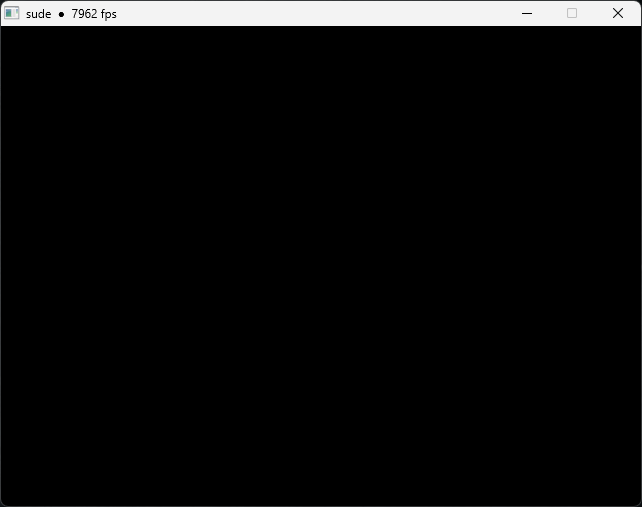

# 2 - The Singleton Window

For simplicity, our engine will only use one window. Now we could use global scope procedures to manage and control this but there is another approach that may upset a lot of Pascal coders... Using an abstract class as a singleton!

Although frowned upon by most, this method will allow us to contain our single window into a sort of pseudo-object/namespace.

Concider the following:
```Delphi
type
  Window = class abstract
  private class var
    FSomeProperty: Integer;
  public
    class procedure SomeMethod;

    class property SomeProperty: Integer read FSomeProperty write FSomeProperty;
  end;
```

We never need to create an instance of the `Window` class as all of it's properties and methods belong to the class. Therefore we have a singleton `Window` class that can be accessed as if it were a single global object.
```Delphi
Window.SomeProperty := 12345;
Window.SomeMethod();
```

After a while of playing about I managed to get a pretty basic but complete window class that exposes these methods and properties:
```Delphi
// Start and stop the application
procedure Run(const AWidth, AHeight: Integer);
procedure Stop;

// Handles window messages
function ProcessMessages(const AWait: Boolean = False): Cardinal;

// Low-level window information
property Handle:        HWND;
property DeviceContext: HDC;
property RenderContext: HGLRC;

// For scaling pixels for all those trendy retro pixel games :)
property Scale: Single read FScale write SetScale;

property Width:  Integer;
property Height: Integer;

property ClientWidth:  Integer;
property ClientHeight: Integer;

// Controls the timing of the window. Refreshes can be lock to monitor refresh rates and/or update frequency
property VSync:     Boolean;
property Frequency: Integer;

// If the app is currently running (ie. in it's render loop)
property Running: Boolean;

// The elapsed time in second the app has been running
property Elapsed: Double;

// Information to show in the title bar
property ShowFramesPerSecond: Boolean;
property ShowSecondsPerFrame: Boolean;
property ShowFrameDelta:      Boolean;
property ShowElapsed:         Boolean;
```

Getting an app started now looks like this:
```Delphi
program Test;

uses
  sude;

begin
  Window.Run(640, 480);
end.
```

Although we are doing nothing special yet, here is a screenshot of nothing for "completeness"



